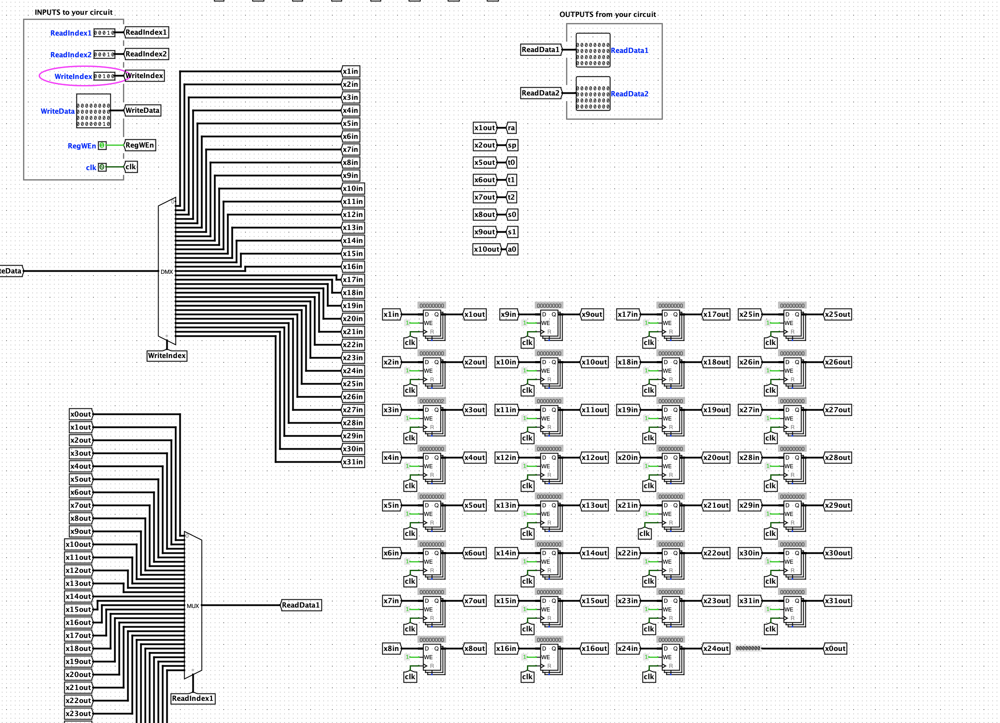

# CS61CPU

Look ma, I made a CPU! Here's what I did:

-

## task2

遭老罪了，设计思路不对。

这样会导致每次循环之前寄存器里的内容都会被清除，所以应该控制写使能。

## task9

非常离谱的一点，debug了好久好久！

下面图中所示的ALU的输出要接到MemAddress！这一点很关键，我之前是吧alures接进了store和load的Address里面，但是这样会导致在load命令的时候，MemReadData里面的内容不会更新！

